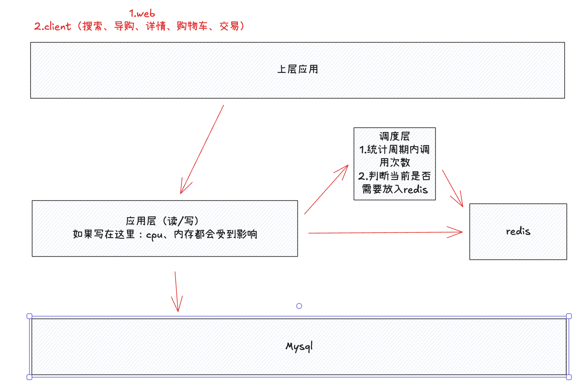
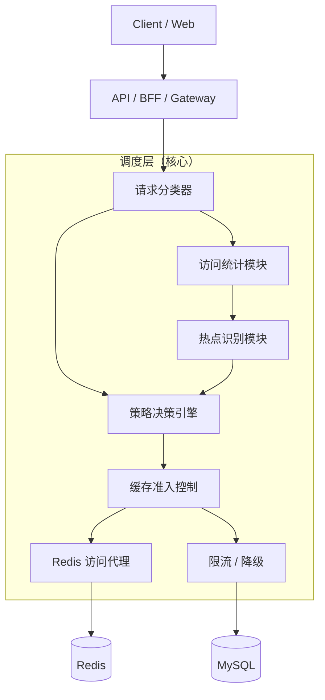

# Ali-Intern

## 2026.01.22 - 作业1

### 1. 商品信息（商品本身信息量很大（字段多），同时有很非常多的商品（数据多）），垂直分表、水平分表的选型

先垂直，后水平。建表的时候先进行垂直分表，插入数据的时候进行水平分表。垂直分表需要依靠人工来完成，水平分表则可以使用中间件进行自动拆分。

* 垂直分表的规则中，高频、轻量的字段放在一张表中，低频、大的字段放在一张表中
* 水平分表的规则中，可设置达到一定的行数（比如10万行，100万行）然后根据id取模或者创建时间来拆分

### 2. 详细设计调度层系统：

对于上图中的调度层具体实现如下图：

* 请求分类器：在请求进入调度层的最开始，**对请求进行快速、轻量级的价值与类型判断，将不同性质的请求分流到最合适的后续处理路径中**（通常基于请求的 URI、参数结构、业务类型和访问模式），从而避免所有请求都进入高成本的统计与缓存决策流程。

  例：商品详情页或搜索结果页这类具有明显复用价值、可能形成热点的读请求，会被送入访问统计模块进行频次统计和热点识别；而订单提交、支付回调、库存扣减这类写请求或强一致性请求，则会直接跳过统计模块，送入策略决策引擎。

* 访问统计模块：**在全局范围内对有缓存潜力的请求 key进行低成本、高并发的访问频次统计**，为后续热点识别和缓存决策提供客观数据依据（一段时间内某个 key 被反复访问的强度与趋势）。

  例：当大量用户在短时间内访问商品详情时，访问统计模块会在 Redis 中持续累加该 skuId 在当前时间窗口内的访问次数。

* 热点识别模块：基于访问统计模块输出的频次数据，**判断某个请求 key 是否已经从“普通访问”演变为“热点访问”，并对热点程度进行分级**，供策略决策引擎判断是否将该商品详情写入 Redis、设置多长的缓存 TTL。

  例：某商品 skuId=10086 在过去 1 分钟内访问次数持续低于 10 次时，会被判定为冷数据；当访问次数稳定超过 100 次/分钟时，热点识别模块会将其标记为“热数据”，触发缓存准入逻辑；如果在秒级窗口内访问量突然飙升到上千次，则会被识别为“极热数据”。

* 策略决策引擎：在综合请求类型、热点等级、系统当前状态等多维信息后，**统一做出这次请求该怎么走的最终执行决策，负责把统计与识别结果转化为可执行的访问策略**，而不是简单判断是否命中缓存。
  例：当热点识别模块判定某商品 skuId=10086 为“热数据”时，策略决策引擎可能决定“优先读 Redis、未命中则查 MySQL，并以 60 秒 TTL 回写缓存”；当该商品升级为“极热数据”时，决策引擎则可能调整为“强制走缓存、延长 TTL 到 5 分钟，必要时返回兜底数据”；而对于订单提交、支付回调这类强一致写请求，即使访问频次很高，策略决策引擎也会明确决策为“跳过缓存、直连数据库、必要时启用限流”。

* 缓存准入控制：**在策略决策引擎给出“允许缓存”的前提下，进一步判断某次数据是否值得占用有限的缓存空间，从而防止大量冷数据或偶发请求把 Redis 填满**，它解决的是“能不能缓存”之后的“要不要真的写缓存”的问题。

  例：商品 skuId=10086 虽然在某一分钟内被访问了 20 次，策略决策引擎允许其使用缓存，但缓存准入控制发现该商品访问频次波动大、持续时间短，可能只为临时访问，于是选择只给一个 10 秒的短 TTL，甚至直接放弃写缓存；而对于在多个时间窗口内持续保持高访问频率的 skuId=10087，缓存准入控制会判定其为稳定热点，允许写入 Redis 并分配更长的 TTL。

* Redis访问代理：**在调度层内部对所有 Redis 读写操作进行统一封装与治理，使上层决策逻辑不直接感知 Redis 的具体实现细节，同时集中处理性能优化与异常保护问题**，从而避免业务或策略代码中散落大量 Redis 访问逻辑。

  例：当策略决策引擎决定读取商品 skuId=10086 的缓存时，请求会先经过 Redis 访问代理，由它负责执行批量 pipeline 读取、处理缓存未命中（穿透）、控制回源并发（击穿 ）以及在 Redis 超时或不可用（雪崩）时快速失败并触发降级；再如在写缓存场景下，访问代理可以统一应用 TTL、执行 Lua 脚本保证原子性，或在检测到 Redis 压力过高时直接拒绝写入请求，从而在不修改上层逻辑的情况下，保护缓存系统的稳定性。

* 限流/降级：**在系统已经接近或超过安全承载能力时，主动削减或简化部分请求，以保护核心链路和关键资源不被拖垮**，其关注的不是“单个请求是否正确”，而是“整个系统是否还能活着并稳定对外服务”。

  例：当 Redis 出现大面积超时、导致大量请求开始回源 MySQL 时，限流模块会限制非核心请求（如个性化推荐、历史浏览）的访问频率，而降级模块则可能对商品详情请求直接返回缓存的旧数据或简化字段版本；再比如在大促场景下，如果数据库 QPS 已接近上限，系统会对低价值或匿名用户请求直接拒绝或延迟处理，优先保障下单、支付等核心链路的可用性，从而用牺牲局部功能的方式换取整体系统稳定。

### 3. 了解http、rpc调用的区别 dubbo(通信机制) springcloud Alibaba

**RPC vs HTTP 接口（高频对比）**

| 对比点   | RPC                | HTTP REST             |
| -------- | ------------------ | --------------------- |
| 调用方式 | 方法调用           | URL + 动词            |
| 语义     | 强类型、面向接口   | 资源导向              |
| 性能     | 高（TCP + 二进制） | 相对低（HTTP + JSON） |
| 学习成本 | 较高               | 低                    |
| 可读性   | 较差               | 好                    |
| 典型场景 | 内部微服务         | 对外开放 API          |

调度层计划使用RPC，因为对外接口使用 HTTP 保证通用性，对内高频、强语义的服务间调用使用 RPC，以降低延迟并提升系统整体吞吐，调度层作为基础设施组件更适合采用 RPC 方式对接业务服务。
